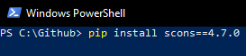
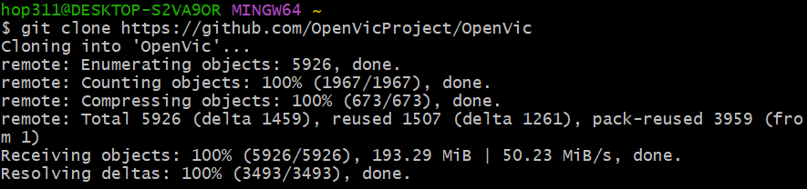
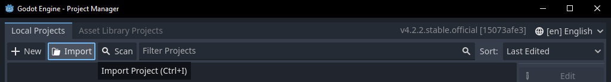
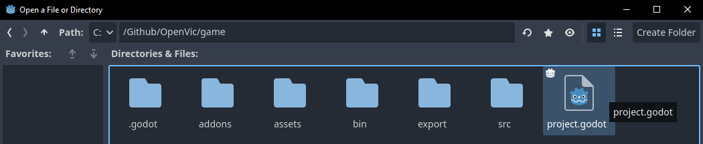
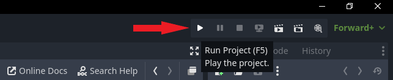

# Contributor Quickstart Guide

## Required Software
- A way to use `git` such as Git Bash or the Windows-Linux Subsystem
- Python 3.x
- Scons
- Godot
- A programming IDE such as Visual Studio Code

# Software Installation
## 1. [Git Bash](https://git-scm.com/download/win)
- Download and run the [64-bit Windows installer](https://github.com/git-for-windows/git/releases/download/v2.39.2.windows.1/Git-2.39.2-64-bit.exe)

- Leave settings as default

## 2. [Python](https://www.python.org/downloads/)
- Download the [latest version of Python](https://www.python.org/downloads/) (this includes `pip`)

- Check "Add python.exe to PATH" and use the "Install Now" option

## 3. Scons
- Open Windows Powershell and run the command `pip install scons==4.7.0`

## 4. [Godot](https://github.com/godotengine/godot/releases/latest)
- Download Godot 4.6 The current version for the project will be on the [main README](../README.md) page.

- Unzip the Godot executable wherever you prefer to have it

## 5. [Visual Studio Code](https://code.visualstudio.com/download) (IDE)
- For editing the C++ portion of the codebase, you may use any IDE that you are comfortable using
- [Visual Studio Code](https://code.visualstudio.com/download) is a popular choice of IDE

# Project Setup

1. [Go to the main repository](https://github.com/OpenVicProject/OpenVic) page on Github

2. Get the link to clone the repo

3. Using Git, clone the repo: `git clone https://github.com/OpenVicProject/OpenVic`

4. Move into the OpenVic directory: `cd OpenVic`

5. Retrieve submodules: `git submodule update --init --recursive`

6. Create and checkout a new git branch for your changes: `git switch -c my-cool-branch`
    - You should give your branch a descriptive name of the changes you intend to make

7. Build the C++ portion of the project by running `scons` in Powershell
    - It will take a minute to initially compile. Any future C++ changes only need to recompile the files that were changed and are much faster

8. Run the Godot executable

9. Select the 'Import' project button

10. Navigate to the `OpenVic/game/` directory and select the `project.godot` file

11. Select "Import & Edit"

12. This will open the Godot editor! Make your changes as desired and press the "Play" button in the top-right corner to run the game in-editor.

# Contributing your changes!

Whenever you are ready to commit your changes follow this process:

1. Run `git status` to show what files are new or changed

2. Run `git add ...` for each of the modified files

3. Run `git commit -m "A descriptive commit message"` to make a commit with your staged changes

4. Run `git push` to upload your current commits to your working branch
    - If you're warned that your branch has no upstream branch, run `git push --set-upstream origin my-cool-branch`, replacing "`my-cool-branch`" with whatever your branch is named in [Part 6 of Project Setup](#project-setup)

