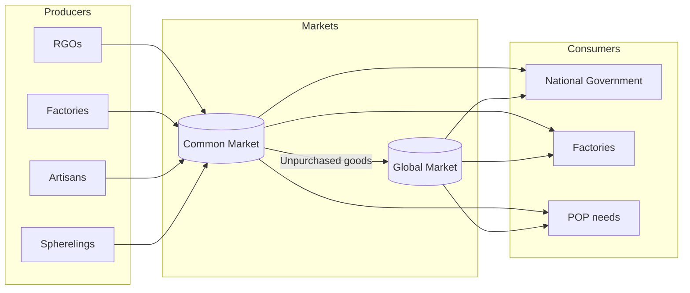

# Economy Design

> **Warning**
> The following document is ***not in a finished state***

## Glossary and Common Terms
| Term | Abbreviation | Additional Notes |
|------|:------------:|------------------|
| Resource Gathering Operation | RGO | Farmers/Labourers produce raw goods at RGOs |
| Sphereling                   |  -  | Informal term for a nation within a Great Power's Sphere of Influence|
| Spherelord                   |  -  | Informal term for a Great Power which has a Sphere of Influence |

## Goods & Trade

<!--
Discord User: ape#1209
Original infograph: u/wael_M
https://www.reddit.com/r/victoria2/comments/j2xmfp/victoria_ii_economy_production/

Comments from ape#1209:
okay so the wrong parts of this graphic are
1. "more social reforms means that the profit is more evenly distributed" is wrong. 
it's hardcoded how the profits are shared from factories. the profit is split 50/50, one half goes into the factory's budget, which is spent on buying input & maintenance goods. the other half is then split again between the capitalists and the workers and paid as wages. and for the workers again it's split 50/50 between the clerks and craftsmen in the state. the factory budget however has a cap for how much money it can have, and when it's reached, all money put into the budget go directly to the capitalists.
now, what minimum wage does do, is create a minimal wage which a factory has to pay, even if it's unprofitable. this however doesn't change any of the above percentages. once the wage calculated from profits is higher than the minimum wage, it doesn't affect the distribution at all. it only really kills factories with too small profit margins and makes it more expensive to subsidize bad factories

2. aristocrats don't invest in production
capitalists invest part of their income into construction projects, aristocrats don't. any pop can contribute to the national bank, however (aristocrats usually don't do this either, they don't make enough money)

3. prestige doesn't matter, overall rank does
what's important to know is that rank determines both buying and selling order on the world market. also that factories buy their input goods from the world market first, which can be counterproductive if you're trying to set up a supply chain for throughput bonuses

4. taxes are silly
this is a nitpick but it should be explained regardless. the way taxes are actually calculated are that they take a percentage of each purchase made by a pop, strictly making it a consumption tax but functioning as income tax. tariffs are the same, but only apply to good purchased from the world market (and also apply to factory purchases)
now, most of this is kinda banal. what will really be a headache is trying to figure out how the spheres work, and how they're supposed to work. currently in the game they're very bizarre and don't make any sense? especially not as a sphereling.
-->