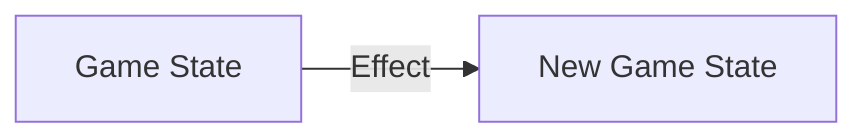

# Effects and their Scopes
> **Warning**
> The following document is ***not in a finished state***

## Effects
In creating a dynamic game, we need a way to express changes in the game-world. These changes are an `Effect`



An `Effect` contains one or more `statements` or `Effects`. A `statement` represents a change to a single attribute.

However, how do we know what attributes are available to change?

## The Five Fundementals
To know what attributes can be changed, we will specify the type of item that we wish to modify.

There are five fundemental categories of items which a modder would be interested in changing:
- `Nation`
- `Province`
- `Pop`
- `Good`
- `Unit`


## Scoped Effects
To narrow an effect to specific instances of an item, we specify the `target category`, followed by the `where` keyword along with a `scope condition`. This would apply the effect statements to all items belonging to the `target category` where the `scope condition` evaluates to `true`.

For example, the following scoped effect would increase the prestige and money of all nations who had a literacy rate above 70%:
```
Nation where (literacy > 70) {
	prestige += 5
	money += 1000
}
```

## Multiple Scopes
In order to achieve more granular control over effects, use nested scopes.

This effect turns all Irish fish provinces into gold mines:
```
Nation where (nationId == "Ireland") {
	Province where (tradeGood == "fish") {
		tradeGood = "precious_metal"
	}
}
```
<!-- 
```
Nation where (nationId == "Ireland") with Province where (tradeGood == "fish") {
	tradeGood = "precious_metal"
}
```
-->

All fundemental items are valid scopes. The nested scopes which are allowed are within the following table:
| Scopes                     | Meaning                              |
|----------------------------|--------------------------------------|
| Nation                     | All Nations that satisfy condition   |
| Province                   | All Provinces that satisfy condition |
| Pop                        | All Pops that satisfy condition      |
| Good                       | All Goods that satisfy condition     |
| Unit                       | All Units that satisfy condition     |
| Nation -> Province         | All Provinces that are X within Nations that are Y |
| Nation -> Pop              | All Pops that are X within Nations that are Y |
| Nation -> Unit             | All Units that are X within Nations that are Y |
| Nation -> Province -> Pop  | All Pops that are X within Provinces that are Y within Nations that are Z |
| Province -> Pop            | All Pops that are X within Provinces that are Y |


## Further Examples

### Increase the fort level by one in provinces that have a level 0 or 1 fort and reduce the conciousness of the soldier pops within those provinces
```
Province where fortLevel < 2 {
	fortLevel += 1
	Pop where (popType == "soldier") {
		conciousness -= 1
	}
}
```

### Raise the base price of Machine Parts
```
Good where (goodId == "machine_parts") {
	basePrice += 1.5
}
```

### Turn all Irregular units into Guards for Russia and Poland
```
Nation where (nationId == "Russia" or nationId == "Poland") {
	Unit where (unitType == "Irregular") {
		unitType = "Guard"
	}
}
```

### For France: Recieve £250, triple the speed of Cavalry and Dragoons, and increase the number of clerks by 10 in occupied provinces
```
Nation where nationId == "France" {
	money += 250
	Unit where unitType == "Cavalry" or unitType == "Dragoons" {
		speed *= 3
	}
	Province where controllingNation == "France" and owningNation != "France" {
		Pop where popType == "Clerk" {
			size += 10
		}
	}

}
```