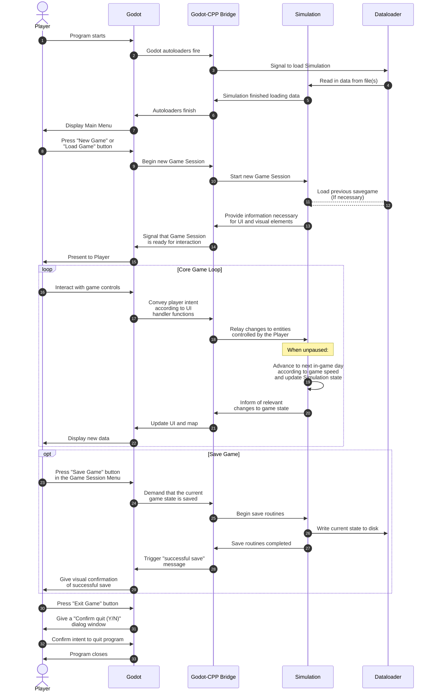

# Player-Game Interaction

```mermaid
sequenceDiagram
actor Player
participant UI as Godot
participant Bridge as Godot-CPP Bridge
participant Simulation
participant Dataloader
autonumber

Player ->> UI: Program starts
UI ->> Bridge: Godot autoloaders fire
Bridge ->> Dataloader: Signal to load Simulation
Dataloader ->> Simulation: Read in data from file(s)
Simulation ->> Bridge:  Simulation finished loading data
Bridge ->> UI: Autoloaders finish
UI ->> Player: Display Main Menu
Player ->> UI: Press "New Game" or<br>"Load Game" button
UI ->> Bridge: Begin new Game Session
Bridge ->> Simulation: Start new Game Session
Simulation -->> Dataloader: Load previous savegame<br>(If necessary)
Dataloader -->> Simulation: 
Simulation ->> Bridge: Provide information necessary<br>for UI and visual elements
Bridge ->> UI: Signal that Game Session<br> is ready for interaction
UI ->> Player: Present to Player

loop Core Game Loop
Player ->> UI: Interact with game controls
UI ->> Bridge: Convey player intent<br>according to UI<br>handler functions 
Bridge ->> Simulation: Relay changes to entities<br>controlled by the Player
Note over Simulation: When unpaused:
Simulation ->> Simulation: Advance to next in-game day<br>according to game speed<br>and update Simulation state
Simulation ->> Bridge: Inform of relevant<br>changes to game state
Bridge ->> UI: Update UI and map
UI ->> Player: Display new data
end

opt Save Game
Player ->> UI: Press "Save Game" button<br>in the Game Session Menu
UI ->> Bridge: Demand that the current<br>game state is saved
Bridge ->> Simulation: Begin save routines
Simulation ->> Dataloader: Write current state to disk
Simulation ->> Bridge: Save routines completed
Bridge ->> UI: Trigger "successful save"<br>message
UI ->> Player: Give visual confirmation<br>of successful save
end

Player ->> UI: Press "Exit Game" button
UI ->> Player: Give a "Confirm quit (Y/N)"<br>dialog window
Player ->> UI: Confirm intent to quit program
UI ->> Player: Program closes
```