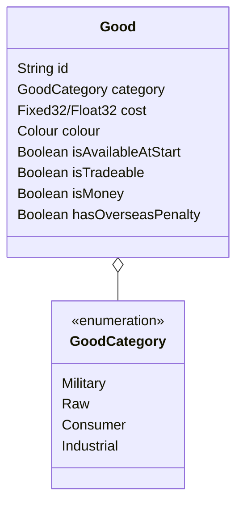

# OpenVic Goods

## Victoria 2 Structure

## OpenVic Structure

## Data

### Vanilla

|Identifier|Category|Cost|Colour|Available At Start|Is Tradeable|Is Money|Has Overseas Penalty|
|--|--|--|--|--|--|--|--|
|ammunition|Military|17.50|208 202 127|False|True|False|False|
|small_arms|Military|37.00|189 118 22|False|True|False|False|
|artillery|Military|60.00|145 130 86|False|True|False|False|
|canned_food|Military|16.00|255 39 12|True|True|False|False|
|tanks|Military|98.00|55 41 9|False|True|False|False|
|aeroplanes|Military|110.00|221 213 182|False|True|False|False|
|coal|Raw|2.30|11 29 77|True|True|False|False|
|cotton|Raw|2.00|255 255 255|True|True|False|False|
|dye|Raw|12.00|69 0 182|True|True|False|False|
|iron|Raw|3.50|111 111 111|True|True|False|False|
|oil|Raw|12.00|0 0 0|True|True|False|False|
|precious_metal|Raw|8.00|253 199 110|True|False|True|False|
|rubber|Raw|7.00|123 110 86|True|True|False|False|
|silk|Raw|10.00|125 158 43|True|True|False|False|
|sulpher|Raw|6.00|181 228 102|True|True|False|False|
|timber|Raw|0.90|146 72 17|True|True|False|False|
|tropical_wood|Raw|5.40|213 177 118|True|True|False|False|
|wool|Raw|0.70|234 195 158|True|True|False|False|
|steel|Industrial|4.70|95 128 147|False|True|False|False|
|cement|Industrial|16.00|185 187 164|True|True|False|False|
|machine_parts|Industrial|36.50|177 198 196|False|True|False|False|
|glass|Industrial|2.90|201 200 199|True|True|False|False|
|fuel|Industrial|25.00|145 110 89|False|True|False|False|
|fertilizer|Industrial|10.00|133 101 35|True|True|False|False|
|explosives|Industrial|20.00|192 68 20|False|True|False|False|
|clipper_convoy|Industrial|42.00|21 65 30|False|True|False|True|
|steamer_convoy|Industrial|65.00|76 18 0|False|True|False|True|
|electric_gear|Industrial|16.00|255 255 0|False|True|False|False|
|fabric|Industrial|1.80|186 50 40|True|True|False|False|
|lumber|Industrial|1.00|180 94 26|True|True|False|False|
|paper|Consumer|3.40|216 185 77|True|True|False|False|
|cattle|Consumer|2.00|84 227 40|True|True|False|False|
|fish|Consumer|1.50|128 98 73|True|True|False|False|
|fruit|Consumer|1.80|255 0 0|True|True|False|False|
|grain|Consumer|2.20|219 157 36|True|True|False|False|
|tobacco|Consumer|1.10|100 69 30|True|True|False|False|
|tea|Consumer|2.60|201 135 15|True|True|False|False|
|coffee|Consumer|2.10|27 19 7|True|True|False|False|
|opium|Consumer|3.20|114 162 47|True|True|False|False|
|automobiles|Consumer|70.00|61 67 64|False|True|False|False|
|telephones|Consumer|16.00|123 112 54|False|True|False|False|
|wine|Consumer|9.70|123 0 54|True|True|False|False|
|liquor|Consumer|6.40|76 5 0|True|True|False|False|
|regular_clothes|Consumer|5.80|217 17 19|True|True|False|False|
|luxury_clothes|Consumer|65.00|234 227 40|True|True|False|False|
|furniture|Consumer|4.90|173 129 40|True|True|False|False|
|luxury_furniture|Consumer|59.00|225 140 184|True|True|False|False|
|radio|Consumer|16.00|129 63 6|False|True|False|False|

### John Cena

|Identifier|Category|Cost|Colour|Available At Start|Is Tradeable|Is Money|Has Overseas Penalty|
|--|--|--|--|--|--|--|--|
|ammunition|Military|17.50|208 202 127|False|True|False|False|
|small_arms|Military|37.00|189 118 22|False|True|False|False|
|artillery|Military|60.00|145 130 86|False|True|False|False|
|canned_food|Military|16.00|255 39 12|True|True|False|False|
|tanks|Military|98.00|55 41 9|False|True|False|False|
|aeroplanes|Military|110.00|221 213 182|False|True|False|False|
|coal|Raw|2.30|11 29 77|True|True|False|False|
|cotton|Raw|2.00|255 255 255|True|True|False|False|
|dye|Raw|12.00|69 0 182|True|True|False|False|
|iron|Raw|3.50|111 111 111|True|True|False|False|
|oil|Raw|12.00|0 0 0|True|True|False|False|
|precious_metal|Raw|8.00|253 199 110|True|False|True|False|
|precious_goods|Raw|7.00|247 241 61|True|False|True|False|
|rubber|Raw|7.00|123 110 86|True|True|False|False|
|silk|Raw|10.00|125 158 43|True|True|False|False|
|sulpher|Raw|6.00|181 228 102|True|True|False|False|
|timber|Raw|0.90|146 72 17|True|True|False|False|
|tropical_wood|Raw|5.40|213 177 118|True|True|False|False|
|wool|Raw|0.70|234 195 158|True|True|False|False|
|steel|Industrial|4.70|95 128 147|False|True|False|False|
|cement|Industrial|16.00|185 187 164|True|True|False|False|
|machine_parts|Industrial|36.50|177 198 196|False|True|False|False|
|glass|Industrial|2.90|201 200 199|True|True|False|False|
|fuel|Industrial|25.00|145 110 89|False|True|False|False|
|fertilizer|Industrial|10.00|133 101 35|True|True|False|False|
|explosives|Industrial|20.00|192 68 20|False|True|False|False|
|clipper_convoy|Industrial|42.00|21 65 30|False|True|False|True|
|steamer_convoy|Industrial|65.00|76 18 0|False|True|False|True|
|electric_gear|Industrial|16.00|255 255 0|False|True|False|False|
|fabric|Industrial|1.80|186 50 40|True|True|False|False|
|lumber|Industrial|1.00|180 94 26|True|True|False|False|
|paper|Consumer|3.40|216 185 77|True|True|False|False|
|cattle|Consumer|2.00|84 227 40|True|True|False|False|
|fish|Consumer|1.50|128 98 73|True|True|False|False|
|fruit|Consumer|1.80|255 0 0|True|True|False|False|
|grain|Consumer|2.20|219 157 36|True|True|False|False|
|tobacco|Consumer|1.10|100 69 30|True|True|False|False|
|tea|Consumer|2.60|201 135 15|True|True|False|False|
|coffee|Consumer|2.10|27 19 7|True|True|False|False|
|opium|Consumer|3.20|114 162 47|True|True|False|False|
|automobiles|Consumer|70.00|61 67 64|False|True|False|False|
|telephones|Consumer|16.00|123 112 54|False|True|False|False|
|wine|Consumer|9.70|123 0 54|True|True|False|False|
|liquor|Consumer|6.40|76 5 0|True|True|False|False|
|regular_clothes|Consumer|5.80|217 17 19|True|True|False|False|
|luxury_clothes|Consumer|65.00|234 227 40|True|True|False|False|
|furniture|Consumer|4.90|173 129 40|True|True|False|False|
|luxury_furniture|Consumer|59.00|225 140 184|True|True|False|False|
|radio|Consumer|16.00|129 63 6|False|True|False|False|

## References

1. Victoria 2 Game Files:
    * common/goods.txt
2. Victoria 2 Wiki:
    * https://vic2.paradoxwikis.com/Production#Goods_Data
    * https://vic2.paradoxwikis.com/Resource_gathering_operation
