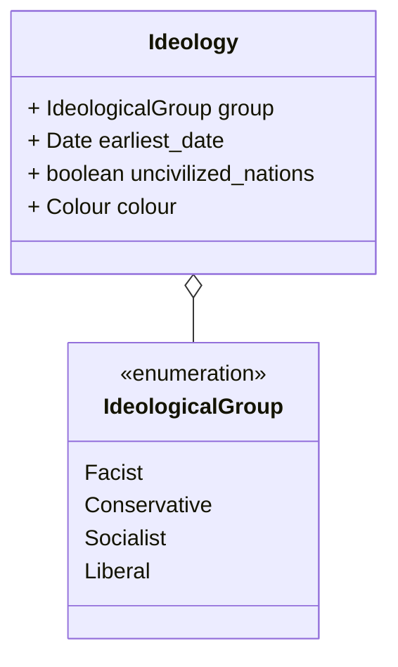

# OpenVic2 Ideologies

## Victoria 2

## OpenVic2

## Data 

### Vanilla

|Identifier|Ideological Group|Earliest Date|Uncivilized Nations|Colour|
|--|--|--|--|--|
|reactionary|conservative|1836/01/01|True|#1E1E64|
|conservative|conservative|1836/01/01|True|#0A0AFA|
|liberal|liberal|1836/01/01|True|#FFFF00|
|anarcho_liberal|liberal|1845/01/01|True|#96960A|
|socialist|socialist|1860/01/01|False|#FF0000|
|communist|socialist|1865/01/01|False|#960A0A|
|facist|facist|1905/01/01|False|#3C3C3C|

### John Cena 

|Identifier|Ideological Group|Earliest Date|Uncivilized Nations|Colour|
|--|--|--|--|--|
|reactionary|conservative|1836/01/01|True|#1E1E64|
|conservative|conservative|1836/01/01|True|#0A0AFA|
|liberal|liberal|1836/01/01|True|#FFFF00|
|anarcho_liberal|liberal|1845/01/01|True|#96960A|
|socialist|socialist|1860/01/01|False|#FF0000|
|communist|socialist|1865/01/01|False|#960A0A|
|facist|facist|1905/01/01|False|#3C3C3C|

## References

1. Victoria 2 Game Files:
    * common/ideologies.txt
2. Victoria 2 Wiki:
    * https://vic2.paradoxwikis.com/Ideology
