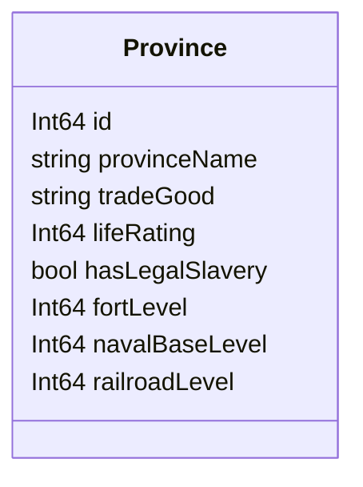

# OpenVic2 Provinces

## OpenVic2 Structure


<!-- The following attributes will need to be added when Nations are added
	NationId owningNation
	NationId controllingNation
	NationId[] coreNations
-->

## Dataloading
The `provinces.json` file shall look like:
```json
{
	"provinces": [
		...
	],

	"regions": [
		{"id": "", "name": "", "provinceIds": [...]},
		...
	],

	"continents": [
		{"id": "", "name": "", "provinceIds": [...]},
		...
	]
}
```
Where the `"provinces"` array contains valid province JSON objects which conform to the following key-value pairs:
| Key | type | Required? | Default Value |
|--|--|--|--|
| id              | int    | required | N/A       |
| provinceName    | string | required | N/A       |
| tradeGood       | string | optional | "no_good" |
| lifeRating      | int    | optional | 0         |
| hasLegalSlavery | bool   | optional | false     |
| fortLevel       | int    | optional | 0         |
| navalBaseLevel  | int    | optional | 0         |
| railroadLevel   | int    | optional | 0         |

### Notes on values
- The values of `fortLevel`, `navalBaseLevel`, and `railroadLevel` may not be negative
- The value of `tradeGood` may only be a Good Identifier string as defined in [goods.md](goods.md) or `"no_good"`