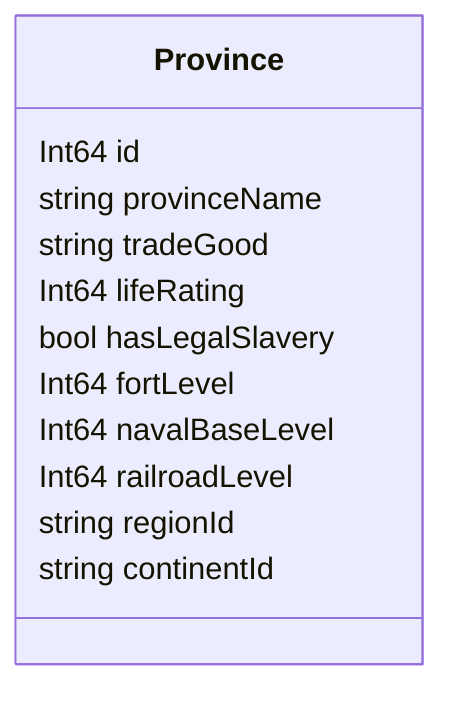

# OpenVic2 Provinces

## OpenVic2 Structure


<!-- The following attributes will need to be added when Nations are added
	NationId owningNation
	NationId controllingNation
	NationId[] coreNations
-->

# Dataloading
To populate the Province structures, the following data files will be loaded in the following order:
1. `provinces.json`
2. `regions.json`
3. `continents.json`

## 1. Provinces.json
The `provinces.json` file shall look like:
```json
{
	"provinces": [
		{"id": 123, "provinceName": "abc", ...},
		...
	]
}
```
Where the `"provinces"` array contains valid province JSON objects which conform to the following key-value pairs:
| Key | type | Required? | Default Value |
|--|--|--|--|
| id              | int    | required | N/A       |
| provinceName    | string | required | N/A       |
| tradeGood       | string | optional | "no_good" |
| lifeRating      | int    | optional | 0         |
| hasLegalSlavery | bool   | optional | false     |
| fortLevel       | int    | optional | 0         |
| navalBaseLevel  | int    | optional | 0         |
| railroadLevel   | int    | optional | 0         |
### Notes on values:
- The values of `fortLevel`, `navalBaseLevel`, and `railroadLevel` may not be negative
- The value of `tradeGood` may only be a Good Identifier string as defined in [goods.md](goods.md) or `"no_good"`


## 2. Regions.json
The `regions.json` file shall look like:
```json
{
	"regions": [
		{"id": "abc", "provinceIds": [123, 456, ...]},
		...
	]
}
```
Where the `"regions"` array contains valid region JSON objects which conform to the following key-value pairs:
| Key | type | Required? | Default Value |
|--|--|--|--|
| id             | string     | required | N/A       |
| provinceIds    | Array[int] | required | N/A       |
### Notes on values:
- The value of `id` may not be an empty string
- The value of `id` must be unique among all continents
- `provinceIds` may be an empty array; an empty array should be logged as a warning
- The content of `provinceIds` may only be Province Identifier integers as defined above
- A province may only belong to a single region, any attempts to re-assign a province's region during dataloading should be ignored and logged as an error


## 3. Continents.json
The `continents.json` file shall look like:
```json
{
	"continents": [
		{"id": "abc", "provinceIds": [123, 456, ...]},
		...
	]
}
```
Where the `"continents"` array contains valid continent JSON objects which conform to the following key-value pairs:
| Key | type | Required? | Default Value |
|--|--|--|--|
| id             | string     | required | N/A       |
| provinceIds    | Array[int] | required | N/A       |
### Notes on values:
- The value of `id` may not be an empty string
- The value of `id` must be unique among all continents
- `provinceIds` may be an empty array; an empty array should be logged as a warning
- The content of `provinceIds` may only be Province Identifier integers as defined in [provinces.md](provinces.md)
- A province may only belong to a single continent, any attempts to re-assign a province's continent during dataloading should be ignored and logged as an error
